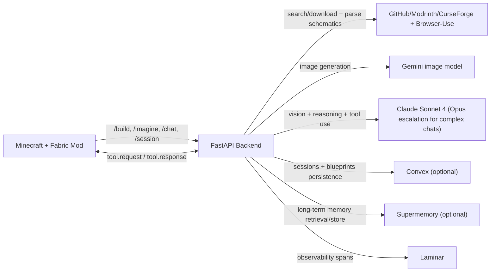

BrowseCraft is a hackathon prototype that lets players search for real schematics, generate new Minecraft structures from text prompts, and iteratively modify builds through an in-game chat agent, all without leaving Minecraft.

## Architecture



## Quickstart

1. Install dependencies and configure environment values.
   ```bash
   cd ~/BrowseCraft/backend
   cp .env.example .env
   # Fill API keys as needed
   uv sync --extra dev
   ```
2. Run backend and mod tests.
   ```bash
   cd ~/BrowseCraft/backend && uv run pytest -q
   cd ~/BrowseCraft/mod && gradle test
   ```
3. Run the backend, launch Minecraft with the built mod, and test commands in-game.
   ```bash
   cd ~/BrowseCraft/backend && uv run browsecraft-backend
   cd ~/BrowseCraft/mod && gradle build
   ```

## Demo Commands

- `/build <query>`
- `/imagine <prompt>`
- `/imagine modify <prompt>`
- `/chat <message>`
- `/blueprints save|load|list`
- `/materials`
- `/session new|list|switch <id>`
- `/build-test` (fallback demo path)

## Browser Use Optimization Workflow

1. Create or reuse a dedicated PlanetMinecraft skill.
   ```bash
   cd ~/BrowseCraft/backend
   uv run python scripts/create_planet_minecraft_skill.py
   ```
2. Create or reuse a Browser Use profile for cookie/session reuse.
   ```bash
   cd ~/BrowseCraft/backend
   uv run python scripts/create_browser_profile.py
   ```
3. Sync your local browser state into the created cloud profile and accept PlanetMinecraft cookies once.
   ```bash
   curl -fsSL https://browser-use.com/profile.sh | BROWSER_USE_API_KEY=... PROFILE_ID=... sh
   ```
4. Benchmark Browser Use models for your workload and keep the fastest one as `BROWSER_USE_PRIMARY_LLM`.
   ```bash
   cd ~/BrowseCraft/backend
   uv run python scripts/benchmark_browser_use_models.py --runs 2
   ```
