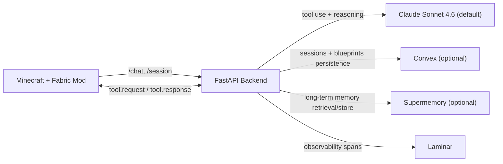

BrowseCraft is a hackathon prototype focused on one interface: `/chat`. The in-game agent inspects the world, reasons about space, and places blocks directly through tool calls.

## Architecture



## Quickstart

1. Install dependencies and configure environment values.
   ```bash
   cd ~/BrowseCraft/backend
   cp .env.example .env
   # Fill API keys as needed
   uv sync --extra dev
   ```
2. Run backend and mod tests.
   ```bash
   cd ~/BrowseCraft/backend && uv run pytest -q
   cd ~/BrowseCraft/mod && gradle test
   ```
3. Run the backend, launch Minecraft with the built mod, and test commands in-game.
   ```bash
   cd ~/BrowseCraft/backend && uv run browsecraft-backend
   cd ~/BrowseCraft/mod && gradle build
   ```

## Demo Commands

- `/chat <message>`
- `/blueprints save|load|list`
- `/materials`
- `/session new|list|switch <id>`
- `/build-test` (fallback demo path)
