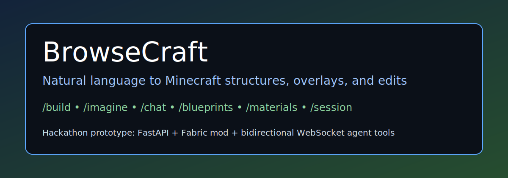
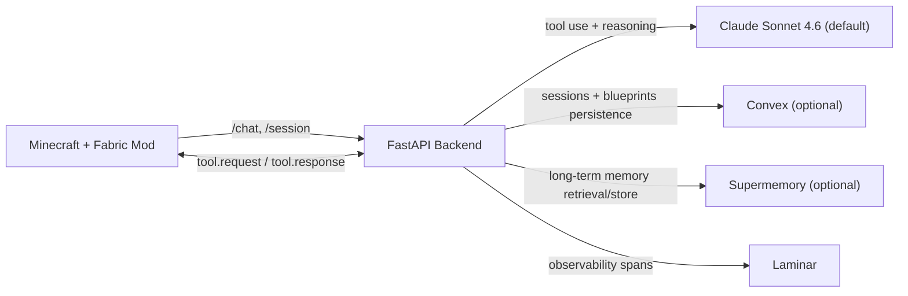

BrowseCraft is a hackathon prototype focused on one interface: `/chat`. The in-game agent inspects the world, reasons about space, and places blocks directly through tool calls.

## Architecture



## Quickstart

1. Install dependencies and configure environment values.
   ```bash
   cd ~/BrowseCraft/backend
   cp .env.example .env
   # Fill API keys as needed
   uv sync --extra dev
   ```
2. Run backend and mod tests.
   ```bash
   cd ~/BrowseCraft/backend && uv run pytest -q
   cd ~/BrowseCraft/mod && gradle test
   ```
3. Run everything with one command, or start backend and client manually.
   ```bash
   cd ~/BrowseCraft
   ./scripts/run-everything.sh
   ```
   Manual path:
   ```bash
   cd ~/BrowseCraft/backend && uv run browsecraft-backend
   cd ~/BrowseCraft/mod && gradle runClient
   ```

## Demo Commands

- `/chat <message>`
- `/blueprints save|load|list`
- `/materials`
- `/session new|list|switch <id>`
- `/build-test` (fallback demo path)

## RL Workflow (HUD + Headless Simulator)

RL development is implemented in `sim/src/browsecraft_sim/rl`.

1. Generate deterministic tiered tasks:
   ```bash
   cd ~/BrowseCraft-rl/sim
   uv run python scripts/generate_hud_tasks.py --seed 7 --per-tier 10 --output remote_tasks.jsonl
   ```
2. Verify the HUD environment wiring:
   ```bash
   cd ~/BrowseCraft-rl/sim
   uv run python scripts/run_hud_smoke.py --skip-debug
   ```
3. Run local HUD MCP dev server:
   ```bash
   cd ~/BrowseCraft-rl/sim
   hud dev env:env
   ```
4. Run baseline evals (Claude only by default):
   ```bash
   cd ~/BrowseCraft-rl/sim
   uv run python scripts/run_baseline_eval.py --tasks-file remote_tasks.jsonl
   ```
5. Collect and export trajectories:
   ```bash
   cd ~/BrowseCraft-rl/sim
   uv run python scripts/collect_claude_trajectories.py --model claude-sonnet-4-6 --per-tier 1 --output raw_episodes.jsonl
   uv run python scripts/export_trajectories.py --input raw_episodes.jsonl --output trajectories.jsonl
   ```
6. Export RFT tasks:
   ```bash
   cd ~/BrowseCraft-rl/sim
   uv run python scripts/export_rft_tasks.py --trajectories trajectories.jsonl --output rft_tasks.jsonl
   ```
